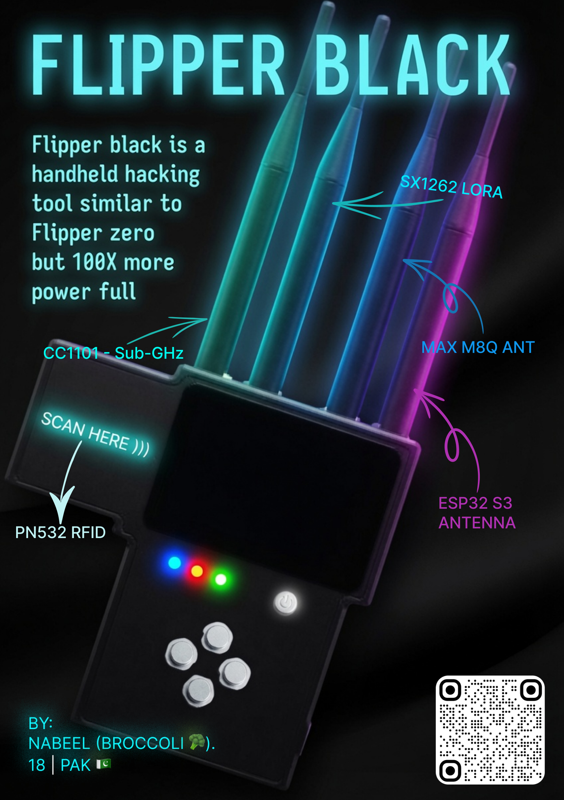

# FLIPPER BLACK

Flipper black is custom made hacking tool, it can out perfrom flipper Zero in almost every aspect. it have better and larger dsplay and have more power and range then flipper zero.

# Wht i built this

I wanted a flipper zero but when i researched about it. i found out that just buying a Flipper Zero is almost useless, to unlock its full power we need to spend more $$, so i decided to build my own with everything in it, no external attachments needed.

# Zine

### CAD n Assembly

